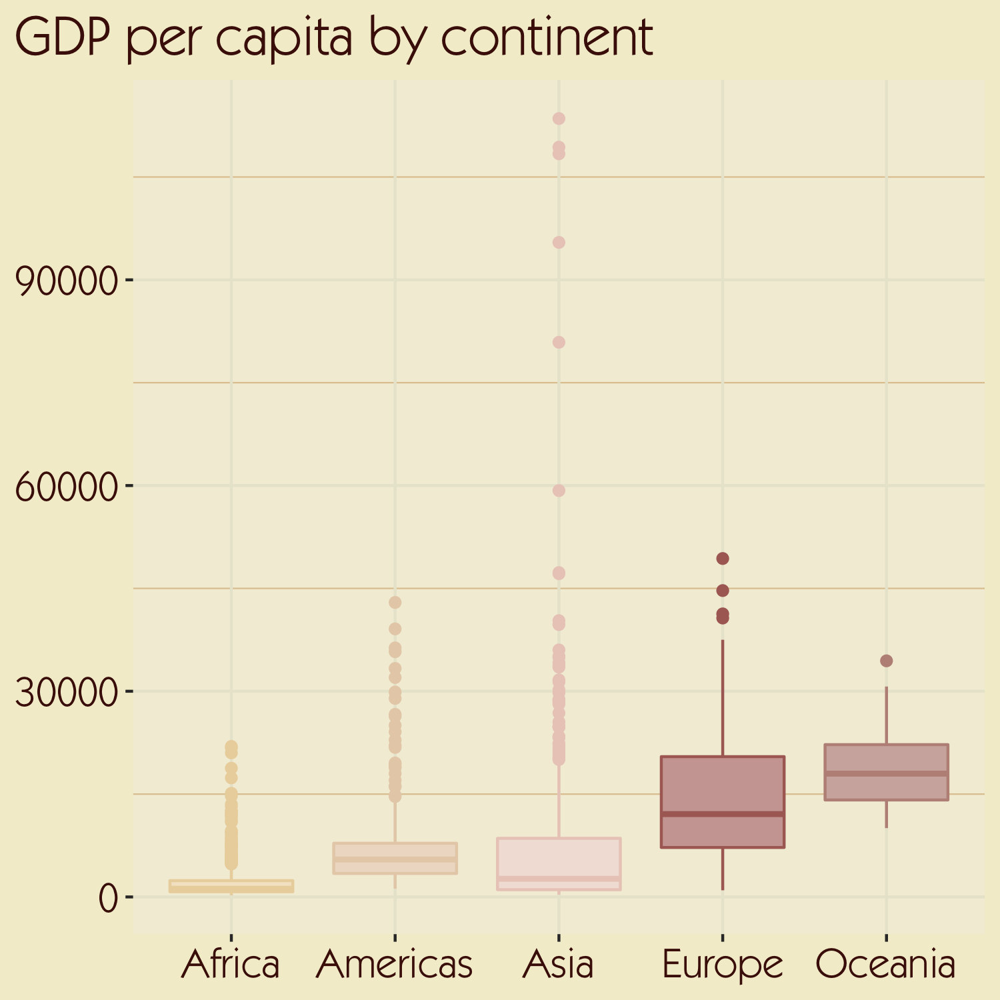
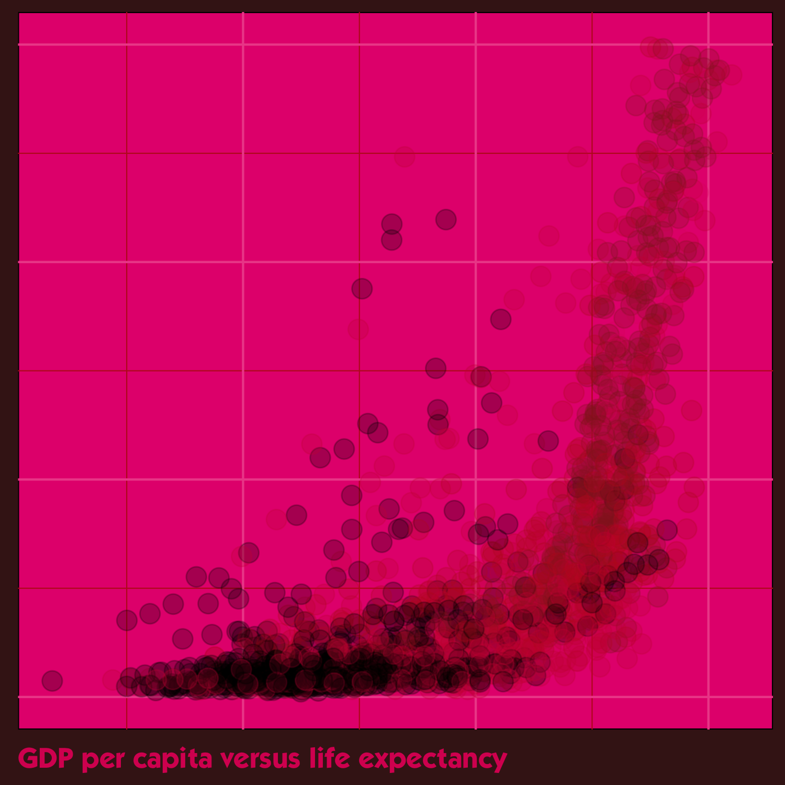
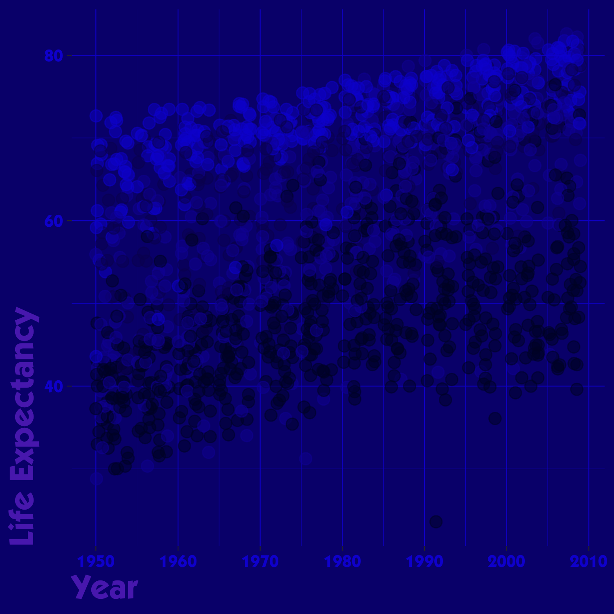

``` r
library(ggplot2)
library(gapminder)
```

# Isn’t Anything (1988)

``` r
isnt_anything <- ggplot(gapminder, aes(
  x = continent, y = gdpPercap,
  fill = continent, colour = continent
)) +
  geom_boxplot() +
  scale_fill_manual(values = c("#F3E5CC", "#EEDDCB", "#F3e1DA", "#CDA6A2", "#D0B2AB")) +
  scale_color_manual(values = c("#ECD5AB", "#E7CFB5", "#EBCDC2", "#AC6B65", "#BD9188")) +
  labs(title = "GDP per capita by continent") +
  theme(
    plot.background = element_rect(fill = "#F3EED0", colour = "#F3EED0"),
    panel.background = element_rect(fill = "#F3EEDA"),
    plot.title = element_text(colour = "#4A1108", family = "ITC Kabel Std Book", size = 20),
    plot.title.position = "plot",
    panel.grid.major = element_line(colour = "#E9E6D3"),
    panel.grid.minor = element_line(colour = "#E0C79F"),
    axis.text = element_text(colour = "#4A1108", family = "ITC Kabel Std Book", size = 15),
    axis.title = element_blank(),
    legend.position = "none"
  )

isnt_anything
```



# Loveless (1991)

``` r
loveless <- ggplot(gapminder, aes(x = lifeExp, y = gdpPercap, colour = continent)) +
  geom_jitter(size = 4, alpha = 0.25) +
  scale_colour_manual(values = c("#000000", "#BE1D22", "#CD1A44", "#932025", "#E1216E")) +
  scale_y_continuous(limits = c(0, 30000)) +
  labs(caption = "GDP per capita versus life expectancy") +
  theme_minimal(base_family = "ITC Kabel Std Bold") +
  theme(
    plot.background = element_rect(fill = "#421A1A", colour = "#421A1A"),
    panel.background = element_rect(fill = "#E5247D"),
    panel.grid.major = element_line(colour = "#EE5198"),
    panel.grid.minor = element_line(colour = "#BE1D22"),
    axis.text = element_blank(),
    axis.title = element_blank(),
    legend.position = "none",
    plot.caption = element_text(colour = "#D91A60", hjust = 0, size = rel(1.2))
  )

loveless
```



# mbv (2013)

``` r
mbv <- ggplot(gapminder, aes(x = year, y = lifeExp, colour = continent)) +
  geom_jitter(size = 3, alpha = 0.5) +
  scale_colour_manual(values = rev(c("#1518D5", "#1513D6", "#1412A3", "#0a0861", "#00052F"))) +
  labs(x = "Year", y = "Life Expectancy") +
  theme_dark(base_family = "ITC Kabel Std Bold", ) +
  theme(
    plot.background = element_rect(fill = "#090B7C", colour = "#090B7C"),
    panel.background = element_rect(fill = "#090B7C"),
    panel.grid.major = element_line(colour = "#1519D0"),
    panel.grid.minor = element_line(colour = "#1518D5"),
    legend.position = "none",
    axis.title = element_text(colour = "#5A31BB", size = 20, hjust = 0),
    axis.text = element_text(colour = "#1518D5", size = 10)
  )

mbv
```


